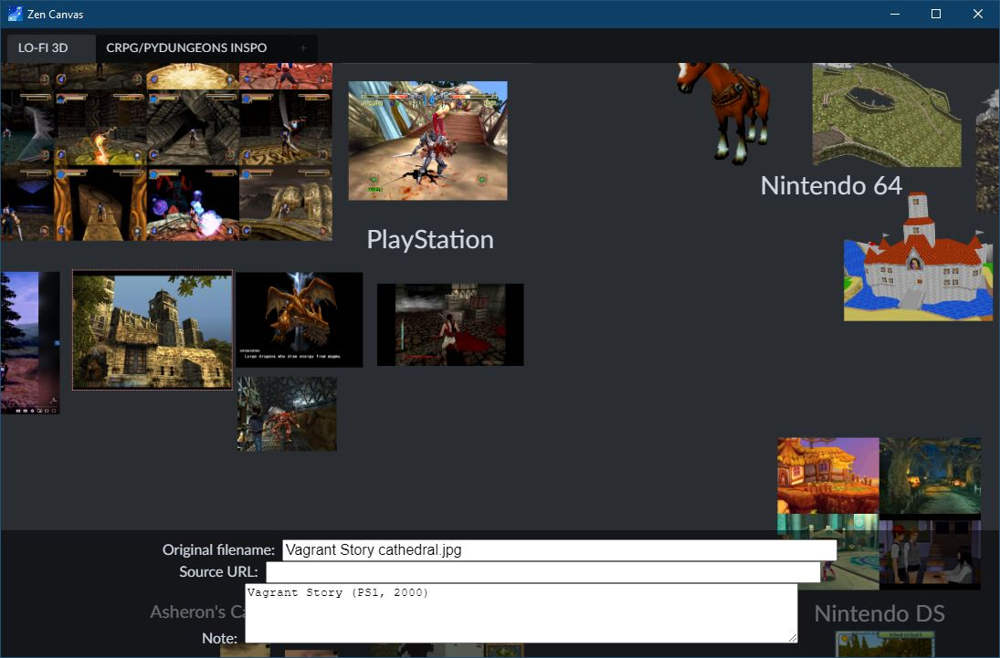

# inspired

    manage.py runserver

## Controls

(based on PureRef controls)

- LMB to select & drag objects
- MMB or arrows to pan
- Mouse wheel or +/- to zoom
- PageUp/Down to resize selected object (temporary)
- Delete to delete selected object
- Escape to cancel selection

Mobile controls (TODO)

- touch/pinch to pan & zoom
- long press to manipulate object
